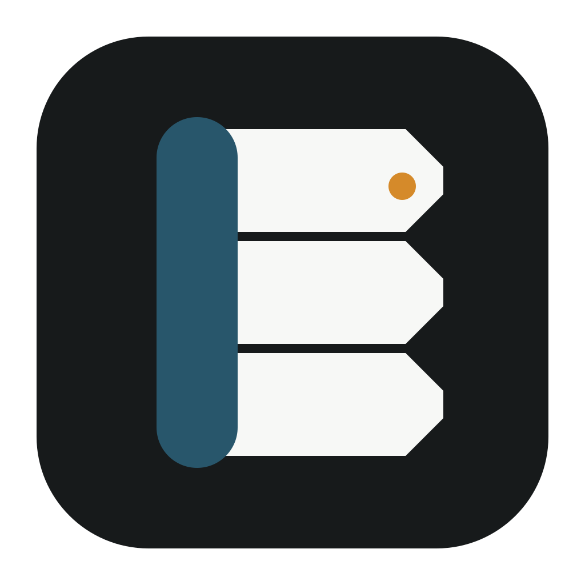
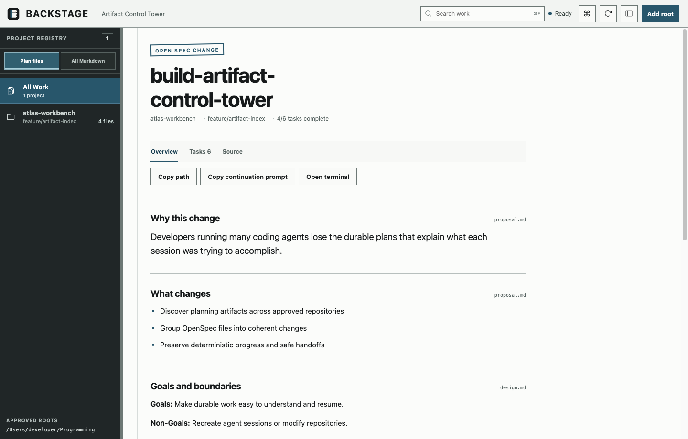

<p align="center">
  
</p>

<h1 align="center">Backstage</h1>

<p align="center"><strong>Pick up where you left off.</strong></p>

<p align="center">
  Find planning work across your local Git projects. See what is done. Give the next agent a clear place to start.
</p>

<p align="center">
  <a href="https://github.com/jzlosman/backstage/actions/workflows/ci.yml"></a>
  <a href="https://github.com/jzlosman/backstage/releases/latest"></a>
  
  <a href="LICENSE"></a>
</p>



## Your plans are everywhere

You made plans in six tabs. The files landed in different repos and folders. Some came from OpenSpec. Others came from Claude, Codex, Pi, a Grill Me session, or your own notes.

Now you need to work out what happened. So does the next agent.

Backstage gathers those planning files into one read-only view. You can see what exists, what is done, and what comes next. Backstage does not change your repos.

## Find the work

Approve a local folder. Backstage finds the Git projects below it and shows the planning work it can read safely.

You can:

- See OpenSpec changes as an overview, task list, or exact source.
- Check task progress from the checkboxes in `tasks.md`.
- Find common plan, TDD, and roadmap files.
- Switch to **All Markdown** when the file you need has another name.
- Search the full index without loading thousands of rows at once.

## Understand where it stands

Backstage keeps facts separate from guesses.

Task counts come from the source file. Parser warnings stay visible. Missing or malformed files stay readable. Optional Pi summaries have their own label, source list, model, and freshness state.

Pi runs only when you ask for a summary. Backstage does not send repository content to Pi in the background.

## Resume the work

Once you find the right plan, copy its exact path or a ready-made continuation prompt. Paste it into a new agent session and continue without rebuilding the context from memory.

Ordinary Markdown files also have a **Copy path** action.

## Keep your repos safe

Backstage treats approved folders as untrusted, read-only input.

- It does not edit, move, archive, or delete repository files.
- It rejects path traversal and links that escape an approved root.
- It stores its index, settings, and generated summaries in app-owned folders.
- It keeps discovery and parsing on your Mac.
- It sends bounded source content to Pi only after a clear request.

Read the full support and safety notes in [`docs/v1-support.md`](docs/v1-support.md).

## Install the public preview

Backstage supports macOS 13 or newer on Apple Silicon and Intel Macs.

1. Open the [latest release](https://github.com/jzlosman/backstage/releases/latest).
2. Download the universal `.dmg` file.
3. Open the disk image and drag Backstage to **Applications**.
4. Launch Backstage and choose **Add root**.

The public release is signed with a Developer ID certificate and notarized by Apple.

## Current limits

This is a public preview.

- The app is macOS-only.
- OpenSpec support covers the file layout described in [`docs/v1-support.md`](docs/v1-support.md).
- The default **Plan files** view recognizes OpenSpec changes and a small set of common planning names.
- **All Markdown** can browse every safely indexed `.md` file, but ordinary documents do not receive planning status or Pi actions.
- Pi summaries are optional and require the audited Pi setup listed in the support guide.
- Backstage does not restore chat history or manage live agent sessions.

## Build from source

You need Rust 1.85 or newer, Node.js 22 or newer, pnpm 10, and the Tauri v2 macOS prerequisites.

```bash
pnpm install --frozen-lockfile
pnpm format
pnpm lint
pnpm test
pnpm typecheck
pnpm build
pnpm exec tauri dev
```

Build the universal macOS app with:

```bash
rustup target add aarch64-apple-darwin x86_64-apple-darwin
pnpm exec tauri build --target universal-apple-darwin
```

See [`DESIGN.md`](DESIGN.md) for the interface system and [`artifact-control-tower-v1.md`](artifact-control-tower-v1.md) for the architecture.

## Contributing

Bug reports and focused pull requests are welcome. Please describe what you expected, what happened, and which planning files were involved. Run the checks above before opening a pull request.

## License

Backstage is available under the [MIT License](LICENSE).
